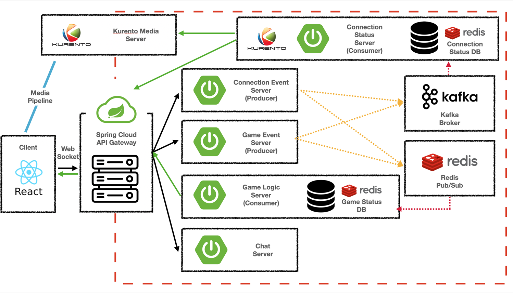

# 백엔드 설계 회의

- Sub 2 목표
    - 게임 로직 기능 구현
    - front 와 back 의 영상 처리 연결
    - user session 관리
    - 각각의 서버가 어떤 역할을 맡을지, response를 어떻게 돌려줄지 구해야 한다.
    - 이벤트를 어떻게 나눌 것인가.
        - 방 만들기(Publishing Connection Server)
            - Client → API Gateway → Connection Server (Roomid, userid, userSession ) → Kafka Brocker → Connection Control Server → KMS → 방 만들기 성공!
            - KafkaBrocker → Chatting Server (Subscirbe)
            - 예외 :  user session 이 겹치는 경우, KMS- Client 연결이 안된 경우
        - 방 접속
            - Client → API Gateway → Connection Server (Roomid, userid, userSession ) → Kafka Brocker → Connection Control Server →   Redis DB (User Info - user id, userSession)→ 방 접속 성공!
            - KafkaBrocker → Chatting Server (Subscirbe) (Chatting 유저 정보 DB 필요)
            - 예외 : RoomID가 잘못 된 경우??, userSession이 여러방에 걸친 경우, 방 인원수가 초과한경우, 방이 게임중인 경우(분기 처리 - 중도 이탈자/난입꾼)
        - 방 준비
            - Client → API Gateway → Connection Event Sever → Kafka Brocker → Connection Control Server → Connection Status DB 저장
            - Connection Controller Server 의 In-Memroy DB의 상태 (
                
                room id [ 
                
                userSession:{ 
                
                 username : , 
                
                 Ready(boolean) : ,
                
                 Auth : room leader or normal 
                
                }, 
                
                RoomStatus : Start, WAIT 
                
                LOG : {} 
                
                ]
                
                - 접속 할 때 마다 Ready 가 true인지를 확인
                - Ready 이벤트가 발생할 때마다  userSession list를 방문 하면서 4인 이상의 유저가 ready인지 확인
                - 모두 ready 했을 때 시작 가능 활성화
                    - Connection Status Server에서 인원 체크 후 방장 이외 모두 Ready 일때 WebSocket으로 Client에 Start할 수 있는 Event 전달
        - 게임시작(직업배정)
            - Client(방장만 가능) → API Gateway → Game Event Server {Roomid, userSession, userId} (Front가 갖고 있는 경우, 없는 경우에) → Kafka Broker / Redis Pub-Sub publish → Connection Status Server에서 해당 방 게임 중(RoomStatus를 Start)로 변경 → Game Logic Server에서 Game Status DB에 데이터 삽입 {Roomid, userSession, userId} → userSession을 기반으로 직업 배정 → API Gateway를 통해 Client에 맞게 직업 안내 → 낮 시작
                - Roomid, userSession, userId를 Front가 갖고 있는지 없는지
                - API Gateway를 통해 직업 안내 시, 모두에게 Broadcasting 되지 않도록 Server 처리 필요
        - Client 시간 전달 시 전달되는 시간을 Phase 종료 시간으로 통일해서 Client 에게 전달
        - 낮/밤 시간 시작 (Phase : 낮, 시민 투표, 최후변론, 찬반 투표, 밤 투표)
            - Game Logic Server에서 종료 시간을 설정 → Client에게 전달
        - 낮/밤 시간 종료
            - 낮 시간이 종료되면 Game Status DB Phase를 ‘시민 투표’ 로 변경 → 투표 종료 시간 설정 후 Client에게 전달 → 시민 투표 Event 시작
            - 밤 시간이 종료되면 Game Status DB  Phase를 ‘낮’으로 변경 → 낮 종료 시간 설정 후 Client에게 전달
        - 최후 변론
            - Game Logic Server 종료 시간 설정해서 Client한테 전달 → 최후변론 시간 종료 시 [찬반 투표 수행](https://www.notion.so/34919eed2c77467598542bcfe3f98426)
        - 시민 한 명 투표
            - Client → API Gateway → Game Event Server {Roomid, username, suspect} → Redis Pub/Sub → Game Logic Server에서 Roomid, username찾아서 suspect 저장 → Suspect를 키로해서 투표한 username을 list로만들어서 Broadcast
        - 찬반 투표
            - Client → API Gateway → Game Event Server {Roomid, username, execution} → Redis Pub/Sub → Game Logic Server에서 Roomid, username찾아서 execution True False 저장 (사형수 제외) → 방안에 True/False 인원 수 Broadcast
        - 의사 투표
            - Client → API Gateway → Game Event Server {Roomid, username, select} → Redis Pub/Sub → Game Logic Server에서 username으로 온 친구가 직업이 doctor인지 확인, 맞으면 patient 저장 → doctor인 클라이언트에게 patient username 전달 (broadcast X)
        - 마피아 투표
            - Client → API Gateway → Game Event Server {Roomid, username, select} → Redis Pub/sub → Game Logic Server에서 username으로 온 친구가 직업이 마피아인지 확인, 맞으면 victim 저장 → Mafia인 클라이언트들에게 victim username 전달
        - 밤 투표 종료
            - 밤 Timer 종료 → Game Logic Server에서 victim list 확인 → Game Logic Server에서 patient list 확인 → 아래 분기에 맞춰서 처리
                - 마피아 동률 시
                    - db 변화 없이 낮 시작 Event
                - 마피아 지목 상대와 의사 지목 상대 일치 시
                    - db 변화 없이 낮 시작 Event
                - 마피아 지목 상대와 의사 지목 상대 불일치 시
                    - victim 지정된 username의 생사 여부 ‘죽음’으로 변경 → [사망 Event 시작](https://www.notion.so/34919eed2c77467598542bcfe3f98426)
        - 시민 투표 동률
            - Game Logic Server에서 투표 현황 체크하고 동률일 때 [낮 Event 시작](https://www.notion.so/34919eed2c77467598542bcfe3f98426)
        - 게임인원 사망
            - Game Logic Server에서 시작 → Game Status DB username찾아서 생사 여부 ‘죽음’으로 변경 → Kafka Broker에 게임 인원 사망 이벤트 publish → Connection Status Server에서 송신 종료(카메라 끄고 마이크 끄고 ) → Chat Server 사망자 Room 생성 혹은 Join 채팅방 활성화 (채팅 서버 DB 설정?) → Client에게 죽은 사람 broadcast
        - 투표 완료
            
            투표 이벤트가 생길 때 마다 (아래 투표) Game Logic Server에서 참가 인원, 생존자 숫자 체크해서 모두 투표가 완료한지 확인 한 후 투표 완료가 되었다면 시간 상관 없이 완료 이벤트 발행
            
            - 시민 투표  (시민 투표 종료 조건 : 시간 초과 혹은 모두 다 투표)
                - Game Logic Server에서 [최후 변론 Event 시작](https://www.notion.so/34919eed2c77467598542bcfe3f98426)
            - 찬반 투표 (찬반 투표 종료 조건 : 시간 초과 혹은 모두 다 투표)
                - Game Logic Server에서 [게임인원 사망 Event 시작](https://www.notion.so/34919eed2c77467598542bcfe3f98426)
            - [밤 투표 종료 (의사, 마피아 투표 모두 완료 시)](https://www.notion.so/34919eed2c77467598542bcfe3f98426)
        - 게임 종료
            - 게임 인원 사망 Event 발행 → Redis Pub/Sub → Game Logic Server에서 게임 종료 조건 확인 → 게임 종료 Event Kafka, Redis Pub/Sub에 발행 → Connection Status DB에 ‘게임 중’을 ‘대기 중’으로 변경 → Redis Pub/Sub에서 발행된 Event Game Logic Server에서 확인 후 Game Status DB RoomId 매칭된 데이터 삭제 → Chat Server 활성화 → Client에게 종료 Broadcast
        
         장애상황
        
        - 에러 로깅
        - 복구 처리
- 닉네임 설정
    - 닉네임 설정 확인 관련한 API (REST 형식 필요)

- 설계
    
    
    

- 일정
    - 17일 : 스터디 발표, 시스템 설계, 이벤트 스토밍, 시스템 흐름도
    - 18일 : 시스템 흐름도, 시스템 설계, 미디어 서버 환경구축 마무리
    - 19 일 : front-back 컨벤션, 화상회의 서버 작업
    - 20일,21일 : 화상회의 서버작업

- QnA
    - 게임시작이 되고 게임서버에 user 정보를 언제 어떻게 어떤 데이터를 보내줄 것인가? Redis DB는 다르다.
        - Front 와 얘기해보기. (Front가 갖고 있는 경우 : Room id? 없는 경우 Roomid + userSession)
    - 링크 공유는 Front url 공유 / 방접속에서 back 처리
    - 1초마다 response를 보내줘야 하는가?
        - 배포되어있는 인스턴스 시간에 맞추기
        - [http://lab.gamecodi.com/board/zboard.php?id=GAMECODILAB_QnA_etc&page=22&sn1=&divpage=1&sn=off&ss=on&sc=on&select_arrange=headnum&desc=asc&no=904](http://lab.gamecodi.com/board/zboard.php?id=GAMECODILAB_QnA_etc&page=22&sn1=&divpage=1&sn=off&ss=on&sc=on&select_arrange=headnum&desc=asc&no=904)
        - 💡 NTP (Network Time Protocol) NTP(Network Time Protocol)는 패킷교환, 가변 지연 데이터 네트워크를 통해 컴퓨터 시스템간의 시간 동기화를 위한 네트워킹 프로토콜이다.
        - [https://anggeum.tistory.com/m/entry/AWS-EC2-서버-시간-동기화-및-타임존-설정](https://anggeum.tistory.com/m/entry/AWS-EC2-%EC%84%9C%EB%B2%84-%EC%8B%9C%EA%B0%84-%EB%8F%99%EA%B8%B0%ED%99%94-%EB%B0%8F-%ED%83%80%EC%9E%84%EC%A1%B4-%EC%84%A4%EC%A0%95)
        - AWS Chrony
    - 최후 변론은 클라이언트 공지 후 넘어오는가?
        - 투표가 완료되면 해당 시점부터 타이머를 시작할것
        - 일단 클라이언트가 여러명이다. 어떻게 하는가? 어렵다.
    - 대기 중일 때 - 모든 사람이 채팅 서버 subscribe / 게임 중일 때 - 사망자만 채팅 서버 subscriber
    - 여러 투표 항목 어떤 식으로 DB에 저장 할까?
        - 투표마다 DB 엔터티 만들자
        - 각 투표가 끝난 후엔 DB에 저장된 투표 엔터티를 없애버리자!
    - 밤 투표는 시간이 종료되었을 때 합계를 내는 방식 (모두다 투표한다고 끝나지 않음, 중도 투표 변경을 위해? ) → 합의 필요
    - 사망자들에게 전체 직업 나오게 하는 방식?
        - 사망자들은 어떤 카메라를 볼 수 있나?
        - 사망자들에게는 모든 이벤트 Broadcast
            - Game Logic Server에서 response 보낼 때 사망자 항상 추가하기
    - DB 별 생명 주기 및 운영
        - Game Status DB (Redis) 생명 주기
            - 각 방마다 게임 진행 현황 (RoomId에 따른 username, usersession, job, dead or alive)
                - 생성 : 게임 시작 시점
                - 삭제 : 게임 종료 시점
            - 투표 현황 (시민투표, 찬반투표, 밤 투표)
                - 생성 : 투표 시작 시점
                - 삭제 : 투표 종료 시점
        - Chatting DB (Redis)
            - 생성 : 방 생성 시점
            - 종료 : 방 종료 시점
            - Data Format
                
                RoomId : [ {
                
                userSession : 
                
                username :
                
                playing: 
                
                },
                
                ...
                
                ] 
                
                - ‘대기중’ 상태
                    - playing 모두가 false
                - ‘게임중’ 상태
                    - 생존자 playing true
                    - 사망자 playing false
                
                <aside>
                💡 playing이 false인 참가자들만 broadcasting 되도록
                
                </aside>