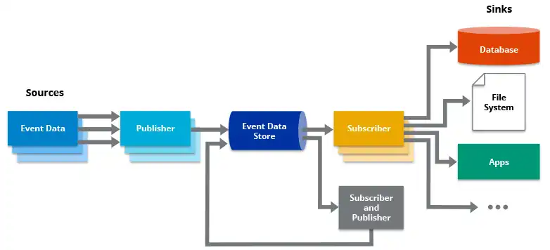
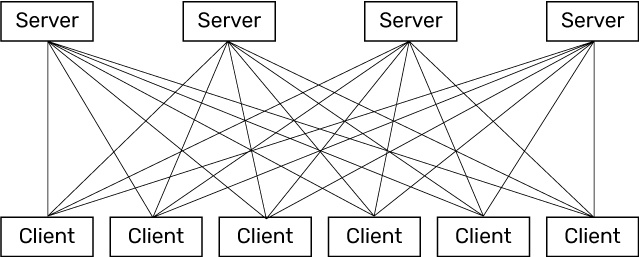
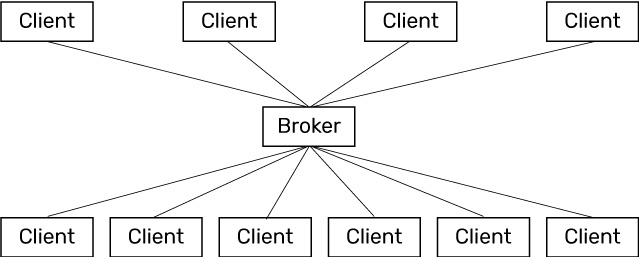

# Event Driven Architecture

## What is Event Driven Architecture?
- 개념이 나온 시점은 오래되었지만, 해당 개념의 영향력이 대단하여 2018년 가트너 선정 유망한 기술 트렌드
- Architecture라는 것을 볼 수 있듯, 시스템 설계 모델 중 하나
- Event 생성자가 큐와 같은 중간자에 이벤트를 발행하고, 소비자가 수신 대기를 하고 있다 이벤트가 전달되면 이를 바탕으로 특정 행위를 수행
- 작은 단위의 서비스로 나눠진 MSA에서 하위 시스템이 하나의 트리거를 기반으로 작업을 수행해야될 때 사용되는 부분
- 게임 진행 시 일어나는 이벤트를 기점으로 여러 개의 서버가 동시 다발적으로 작업을 수행해야 하기 때문에 Event Driven Architecture가 적합하다고 생각

## MSA 내부 통신 방식

- Request/Response 방식 (REST API 기반) 
    - 동기 통신
    - 단일 통신
    - 요청자가 응답자의 주소를 알고 직접 통신
    - Point to Point 방식
    - 요청을 했을 때 응답이 올 때 까지 기다리는 Blocking
    - 응답자 서비스에 장애가 있을 경우 전체 서비스에 문제를 전파하는 위험성 존재

- Pub/Sub 방식 
    - Event Driven 애플리케이션에서 선택되는 모델
    - 비동기 통신
    - 이벤트 생성자는 구독자의 존재를 모르지만 구독자는 특정 메시지들을 바탕으로 수행 가능
    - 구독자는 이벤트에 대한 응답을 기다리지 않는다
    - Event Broadcasting 가능
    - Kafka, Redis Pub/sub, RabbitMQ 사용

## Event Driven Architecture Model
- Pub/Sub(publish / subscribe) Model
    - 이벤트를 생성하는 서버와 이벤트를 구독하는 서버 사이에 메시지 브로커를 구축하는 모델 방식
    - 이벤트가 생성되면 구독을 하고 있는 구독자에게 이벤트가 전송되는 방식

- Event Stream Model 
    - 이벤트 스트리밍 모델을 사용하게 되면 이벤트가 로그에 기록
    - 소비자가 스트림을 구독하진 않지만, 스트림의 모든 부분에서 읽는 것이 가능 + 언제든지 구독자가 스트림에 참여 가능

    * 이벤트 스트리밍의 유형
        - 이벤트 스트림 처리 : Apache Kafka와 같은 데이터 스트리밍 플랫폼 사용하여 이벤트 수집 처리 (이벤트 소싱) 
            - 방 접속과 관련한 이벤트는 모두 이벤트 스트림 처리를 통해 이벤트 수집
        - 단순 이벤트 처리 : 이벤트가 소비자에게 동작을 트리거 하는 경우
            - 게임 진행에 있어 투표와 같은 내용은 모두 단순 이벤트 처리? 
        - 복합 이벤트 처리 : 이벤트 소비자가 패턴 감지를 위해 이벤트를 처리하는 것

## LIE에 EDA가 필요한 이유?
- 한 개의 Event를 바탕으로 전체 서비스가 유기적으로 수행되어야 함 (Event 기점으로 전체 서비스 상태 동기화 필요)
    - 방 만들기 Event이 일어났다면?
        - 영상 처리 서버에서 영상을 위한 Room 생성
        - 접속자들을 위한 채팅방 생성
        - 게임 진행을 위한 게임 상태 (Redis?) 생성 
    - 이벤트 기반 아키텍쳐가 되지 않는다면 직접 모든 서비스에 request 후 response를 순차적으로 받아 수행하게 된다.

- 이벤트에 따라 동작해야하는 서비스가 구분되어야 한다
    - 방 접속 Event가 일어났다면?
        - 영상 처리 서버에서 Media Pipeline 구성 (접속 처리)
        - 게임 상태에서 user와 접속자 연결
        - 채팅방 접속
    - 투표가 진행되고 user 1이 'user2'에 투표했다
        - 게임 상태에서 user 1의 지목상대를 user 2로 매칭
    
    - 이벤트에 따른 서비스 요청을 구분한다면 로직 처리가 매우 어려워질 것이라 예상

## EDA 적용의 고려 사항
- 어떤 브로커(큐, 채널)을 사용할 것인가?
    - Apache Kafka
        - 초당 최대 수백만 개 메시지 가능
        - 일대다 가능
        - 분산처리에 효율 높음
        - 영속성 지원 O

    - Redis Pub/Sub
        - In-memory DB
        - 높은 처리율
        - 영속성 지원 X
        - 단순한 처리만 가능한 수준
        - 매우 빠른 서비스 및 메모리 내 기능을 제공하기 때문에 지속성이 중요하지 않고 약간의 손실을 견딜 수있는 짧은 보존 메시지에 적합하다.

    - 그외에도 RabbitMQ, AMPQ 와 같은 메시지 큐들이 있다

- 에러 상황 (서비스에서의 장애 상황)
    - 브로커 장애 상황

    - Subscriber 장애 상황

- Event 중복(반정규화)에 대한 문제

- Event에 따른 Queue 구분
    - 클라이언트 접속 이벤트
    - 게임 진행 이벤트
    - 서비스 장애 상황 이벤트

- Event 메시지 형식(데이터 형식)에 대한 통일성