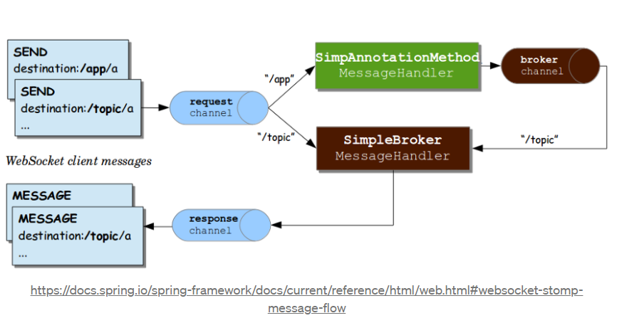
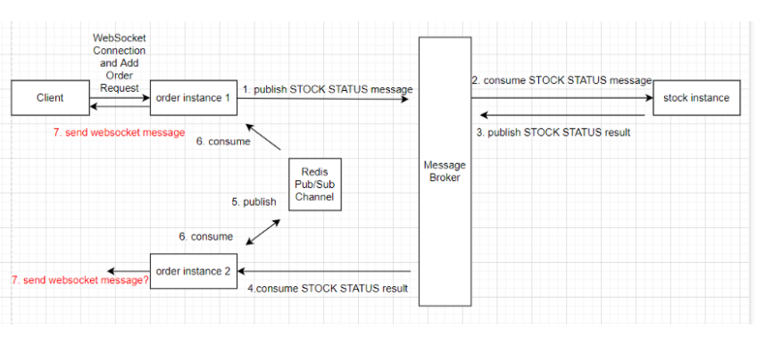
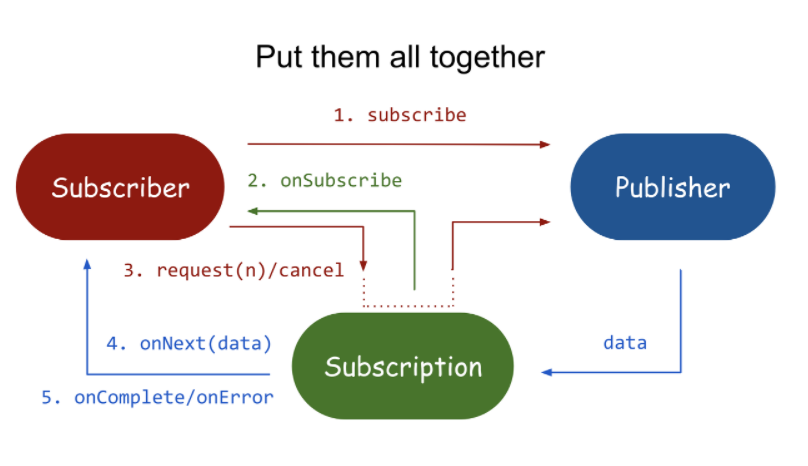
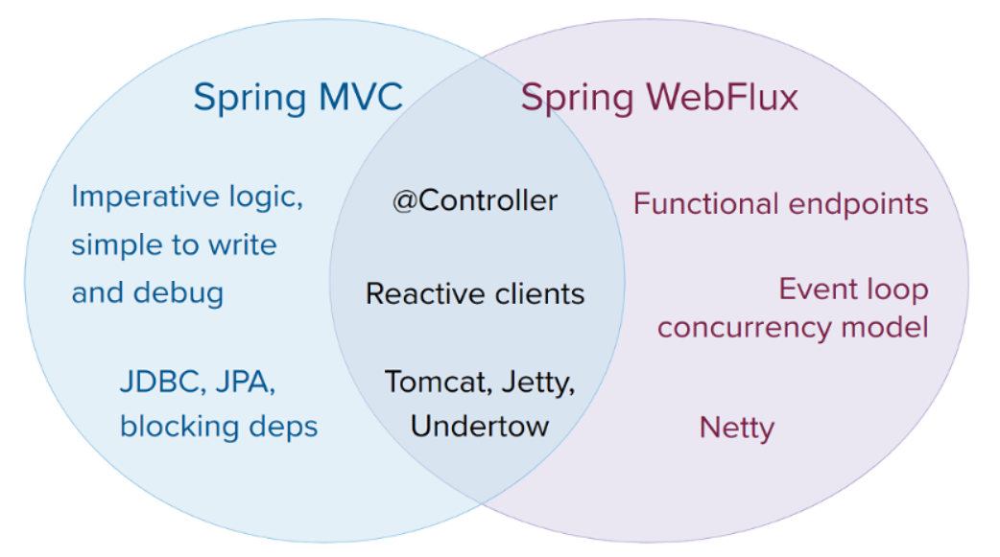
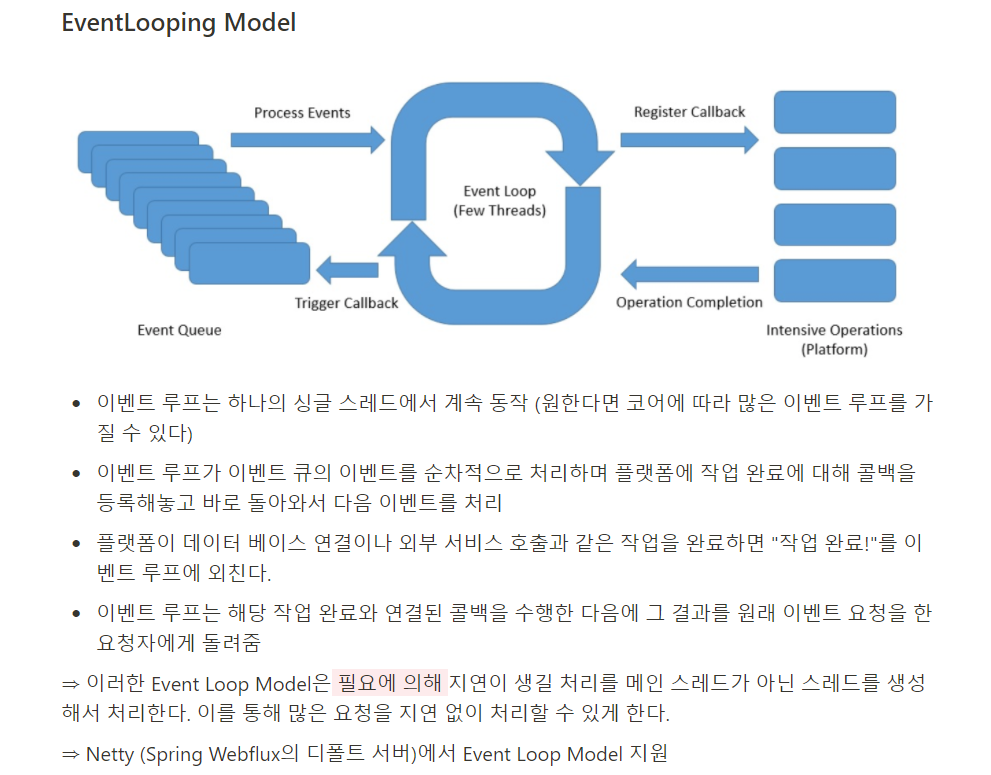

# Redis
- Redis 개요
- SSAFIA 활용
- Reids Pub/Sub
- Redis 사용
- 정리


<br>


## Redis 개요
- Remote dictionary server (Redis) : 외부에 있는 dictionary(key-value 쌍 형태) 자료구조를 사용하는 서버라는 의미이다.
- Redis는 데이터베이스, 캐시 및 메시지 브로커로 사용되는 오픈소스(BSD 라이센스), 인메모리 데이터 베이스 구조 저장소이다.
- Redis는 strings, hashes, lists, sets, sorted sets (with range queries), bitmaps, hyperloglogs, geospatial indexes, streams 자료구조를 제공한다.
  - Strings : Vinary-safe한 기본적인 key-value 구조
  - Lists : String element의 모음, 순서는 삽입된 순서를 유지하며 기본적인 자료구로 Linked - List를 사용
  - Sets : 유일한 값들의 모임인 자료구조, 순서는 유지되지 않음
  - Sorted sets : Sets 자료구조에 score라는 값을 추가로 두어 해당 값을 기준으로 순서를 유지
  - Hahses : 내부에 key-value 구조를 하나더 가지는 Reids 자료구조
  - Bit arrays(bitMaps) : bit array를 다를 수 있는 자료구조
  - HyperLogLogs : HyperLogLog는 집합의 원소의 개수를 추정하는 방법, Set 개선된 방법
  - Streams : Redis 5.0 에서 Log나 IoT 신호와 같이 지속적으로 빠르게 발생하는 데이터를 처리하기 위해서 도입된 자료구조
- Redis는 built-in replication, Lua scripting, LRU eviction, transactions,  different levels of on-disk persistence이 내장되어 있다.
- Redis Sentiner에 의해 높은 고가용성을 제공하고 , Redis Cluster를 통해 자동 파티셔닝 기능을 제공한다.


<br>


## Redis as SSAFia 
- 방 정보를 저장
  - redis를 이용하여 key-value(Strings) 형태로 메모리에 저장
  - 방 정보를 빠르게 조회 가능
  - redis의 동시성 문제를 해결하기 위해 redisson을 통한 분산 lock 활용
- 투표 정보 저장
  - player 투표를 redis에 저장
  - redis 동시성 문제를 해결하기 위해 개인의 투표를 따로 저장
  - server에서 방의 투표자 목록을 별도로 관리
- 게임 정보 전달
  - redis pub/sub 기능을 통해 서버 내부에서 phase가 변해야하는 시점이라고 알리는 event trigger 구현
    - 각 pahse마다 정해진 시간이 있고, 정해진 시간이 지났을 때 phase가 변할 수 있어야 하므로
  - 실시간 메시징 서비스를 구현하기 위해 SockJS와 Stomp 사용
- 사용된 Reids-cli 명령
  ```
    keys * # 모든 key 조회
    hgetall "GameSession:V1234" # GameSession V1234의 모든 field 조회
    hget "GameSession:V1234" hostId # GameSession V1234의 hostId field 조회
    del "GameSession:V1234:idx" # GameSession V1234의 idx 제거 (단, 해당 key만 제거)
    hgetall "Vote" # 모든 플레이어들의 투표 상태 조회
    hget "Vote" playerId # playerId의 투표 상태 조회
    flushall # 모든 key 제거    
  ```

<br>

## Redis Pub/Sub ?
- SUBSCRIBE , UNSUBSCRIBE, PUBLISH 는 senders (publishers)가 특정 receivers (subscribers)에게 메시지를 보내도록 프로그래밍되지 않은  Publish/Subscribe messaging paradigm 을 구현한다.
- 게시된 메시지는 구독자가 있는 경우 구독자가 무엇인지 알지 못한 채 채널로 특성화된다. (message queue에 추가하여 통신)
- 구독자는 하나 이상의 채널에 관심을 표시하고 게시자(있는 경우)가 무엇인지 알지 못한 채 관심 있는 메시지만 받는다. 
- 게시자와 구독자의 이러한 분리는 더 큰 확장성과 더 동적인 네트워크 토폴로지를 허용할 수 있다!!!
- Pub/Sub을 활용하면 구독자가 연결되어 있는 동안 (우리는 게임이 진행되는 동안! 방이 유지되는 동안! ) 메시지 브로커 기능을 받을 수 있다.
  - 연결이 끊긴 동안 놓친 중간 메시지는 수신하지 않지만 해당 사용자가 구독을 취소하지 않은 구독중인 사용자면 예기치 못한 네트워크 끊김에서 해결될 방법이 있을 수 있을 것 같다! (컨설턴트님 문제 제시 부분? - 추가 필요)

### Redis Pub/Sub랑 STOMP는 둘다 메시지 브로커?
- 참고 : https://dgempiuc.medium.com/spring-websocket-and-redis-pub-sub-a02af0dabddb



- Spring은 STOMP 브로커를 인메모리로 제공하고 서버측은 이 경우 클라이언트를 위한 브로커 역할을 한다.
  - 서버가 WebSocket을 통해 메시지를 보내려고 할 때 이 메시지가 먼저 STOMP 브로커에게 전송된다.
  - STOMP 브로커는 연결된 모든 인스턴스에 들어오는 메시지를 보낸다.
  - 즉, 메시지는 모든 인스턴스 간에 다중화된다.
-  Redis 를 쓰면?
   -  Spring WebSocket 및 Redis는 Redis Pub/Sub를 사용하여 클러스터 내에서 통합할 수 있다. 
   -  인메모리 브로커는 STOMP 브로커로 사용되지만 메시지는 WebSocket으로 직접 전송되기 전에 Redis Pub/Sub에 게시된다. 각 인스턴스는 Redis Pub/Sub의 구독자가 됩니다.
   - 즉 , 다시 모든 인스턴스 간에 메시지가 다중화됩니다.
- 여기서 kafka와 많이 비교되는 것 같은데 더 공부하면 좋을 것 같다!
  - kafka는 비동기 통신 / Redis Pub/sub은 동기식 통신
  - kafka는 그룹의 대표자 한명에게 send / Redis Pub/sub은 구독자 모두에게!


<br>


### 여러 Pub/Sub 
1. Apache Kafka 는 분산 데이터 스트리밍의 세계에서 가장 큰 비중을 차지합니다. 오픈 소스 플랫폼을 통해 실시간으로 이벤트 스트림을 게시, 저장, 처리 및 구독할 수 있습니다. Kafka는 확장성이 뛰어나고 안전한 방식으로 Pub/Sub 기능을 제공하여 하루에 수조 개의 이벤트를 처리할 수 있습니다. 또한 on-premises 및 클라우드에 배포할 수 있습니다.

2. Pulsar 는 분산 Pub/Sub 메시징을 위한 또 다른 Apache 제품군 시스템입니다. 처음에 메시지 대기열 시스템으로 설계된 Pulsar는 최근 릴리스에 이벤트 스트리밍 기능을 추가했습니다. 확장성이 뛰어난 시스템은 생산 및 소비 작업을 분리하고 유연한 메시징 모델을 허용합니다.

3. ActiveMQ 는 Apache Software Foundation에서 제공하는 유연한 오픈 소스 메시지 브로커입니다. 여러 생산자와 소비자 간의 주제를 통해 Pub/Sub 메시징 기능을 제공합니다. ActiveMQ는 복잡한 구조에 비교적 쉽게 배포할 수 있습니다. 시스템은 높은 처리량과 높은 신뢰성을 보여줍니다.

4. Redis 는 메시지 브로커 및 데이터베이스로 사용되는 오픈 소스 인메모리 데이터 구조 저장소입니다. Redis는 또한 수백만 개의 요청을 처리할 수 있는 pub/sub 애플리케이션에 널리 사용됩니다.




- WebSocket으로 메시지를 전달하고자 할때 다음처럼 정상적인 구조를 갖게 된다!


<br>


## pub/sub 패턴의 이점

- 효율성: pub/sub 패턴을 사용하면 리스너가 게시자의 새 메시지에 대해 반복적으로 "폴링"할 필요가 없습니다. 대신 메시지가 즉시 전달되므로 실시간 애플리케이션의 주요 이점입니다.
- 확장성: pub/sub 패턴은 게시자와 구독자를 분리하여 각 애플리케이션이 독립적으로 작동하도록 합니다. 이렇게 하면 매우 큰 규모의 시스템을 쉽게 확장하고 시스템의 일부만 변경할 수 있습니다.
- 단순성: 서로 다른 애플리케이션을 통합하고 이들 간의 통신을 처리하는 것은 악명 높은 어려운 작업입니다. 각 애플리케이션은 잠재적인 실패 지점을 나타냅니다. Pub/sub는 개별 애플리케이션 간의 연결을 제거하고 이를 다른 주제에 대한 연결로 대체하여 이러한 복잡성을 상당 부분 제거합니다.
- 이러한 장점 덕분에 로드 밸런싱, 이벤트 기반 아키텍처 및 데이터 스트리밍과 같은 사용 사례에 pub/sub 패턴이 자주 구현됩니다.


<br>


## Redis 활용
- Spring Boot Redis 연결방식
    - Lettuce
    - Jedis
- Redis Spring Boot 사용 방식
    - StringRedisTemplate
    - CrudRepository
- 일반적으로 WebSocket으로 메시지를 전달하고자 할 때 아래와 같이 Spring에서 제공하는 SimpMessagingTemplate 을 사용 한다.
```java
private final SimpMessagingTemplate template;

public void doSomething(String message) {
    template.convertAndSend(topic, message);
}
```
- StringRedisTemplate을 사용하여 Redis 채널에 메시지를 게시하려면?
```java
@RequiredArgsConstructor
public class CustomWebSocketService {

    private final StringRedisTemplate redisTemplate;
    private final ObjectMapper mapper;

    public void convertAndSend(String topic, Object message) {
        var socketData = new WebSocketMessage(topic, message);
        String data = mapper.writeValueAsString(socketData);
        redisTemplate.convertAndSend("<channel-name>", data);
    }
}
```


<br>


### 확장
- 마피아의 일등을 알고 싶어요!
  - Redis의 Sorted Set을 이용하면 랭킹을 구현할 수 있다. 심지어 Disk 레벨 저장하는 것보다 훨~씬 빠른 속도로!
- 친구 리스트를 만들고 싶어요!
  - Context Swtiching 에 의해 Race Condition 문제 발생의 위험이 있다. (특히 multi-thread 환경에서)
    - Race Condition 이란 여러 개의 Thread가 경합하는 것!
  - Redis는 Transaction Read/Write 를 동기화하여 원하지 않은 결과를 막아주고, Redis 자료구조를 통해  Atomic Critical Section(동시에 프로세스가 접근하면 안되는 영역)에 대한 동기화를 제공해준다!


<br>

### 주의 사항
- 메모리 관리를 잘하자
  - In-Memory Data Store이므로 메모리가 꽉차서 다운되는 경우가 발생할 수 있다.
- O(N) 관련 명령어를 주의하자
  - Redis 는 Single Treaded이므로 부하가 나서 터질수있다..
  - 특히 Key, GetAll (SSAFIA는 CLI로 확인할 때 사용하더라)
- Spring에서 제공하는 Websocket을 사용하는 이상 Websocket에서 제공하는 세션관리 방법 안에서 해결책을 찾으려면??
  - SubscriptionRegistry > 추가공부


<br>


## 정리
- 여러대의 분산서버(API 서버 + 채팅 서버 + 영상 서버 )를 사용해야 하는 우리 프로젝트에서 데이터 동기화를 위해 Redis를 사용하자! ( 한 대에서만 사용한다고 하더라도 Redis는 싱글 스레드 형식으로 데이터의 원자성을 보장해준다. )
- 다양한 Collections을 제공하므로써 개발의 편의성을 제공하고 개발 난이도를 낮춰준다.
- 빠른 성능 덕에 Redis는 캐싱, 세션 관리, 게임, 리더 보드, 실시간 분석, 지형 공간, 라이드 헤일링, 채팅/메시징, 미디어 스트리밍 및 게시/구독 앱에서 주로 사용됩니다. (AWS 참고)
  - CPU 성능에 따라 다르지만 redis는 1초에 10만번의 연산을 할 수 있다.
- 다양한 자료구조를 지원한다. JAVA의 자료구조를 사용할 경우, 여러 서버에서 사용하는 것은 Consistency 문제를 발생할 문제가 있기 때문에 Redis Collection을 사용해서 해결하자!!
- 실시간과 확장성을 보장한다.
- 심지어 웹소켓 사용할 때 Redis Pub/Sub의 장점을 가져갈 수 있다.
  - Socket 처럼 쓸 수 있지만 여러대의 서버에서 사용해야 한다면 Redis Pub/Sub을 사용해야 한다. 세션에 문제가 생길 수 있기 때문이다.
- EDA를 쓸때도 Pub/Sub의 장점을 가져갈 수 있다.
  - 동일한 이벤트에 대한 응답으로 작동해야 하는 여러 시스템에 의존합니다.
  - 리소스 상태를 지속적으로 모니터링하고 최소한의 시간 지연으로 변경 및 업데이트에 대한 알림을 수신해야 합니다.
  - Redis pub/sub은 느슨한 결합을 보장한다 (구독자가 누군지, 게시자가 누군지 신경쓰지 않음)

<br>


# Reactive Programing
- Reactive Programing 개요
- WebFlux
- 활용
- 정리

## 개요

### Reactive란?
- Reactive하다는 것은 외부에서 어떠한 event가 발생했을 때 그에 대응하는 방식으로 코드를 작성하는 프로그래밍 패러다임입니다. 
- 리액티브 프로그램은 주변의 환경과 끊임없이 상호작용을 하는데 프로그램이 주도하는 것이 아니라 환경이 변하면 이벤트를 받아 동작한다. (이게 우리 프로그램에 필요한 이유중 하나!)


### Reactive Programing
- 리액티브 프로그래밍은 데이터 흐름을 먼저 정의하고 데이터가 변경되었을 때 연관되는 함수나 수식에 의해서 업데이트 되는 방식.
- 리액티브 연산자를 활용하여 함수형 프로그래밍 방식으로 스레드에 안전한 비동기 프로그래밍 방식이다.
- 기존 pull 방식 (DB에서 받아와서 새로고침할 때 갱신)의 프로그래밍 개념을 push 방식(이벤트 발생시 갱신)의 프로그래밍 개념으로 바꾼다. (Observer 패턴의 확장느낌)
- 함수형 프로그래밍의 지원을 받는다.    
  - 함수형 프로그래밍은 Side Effect(부수효과)가 없다.콜백이나 옵저버 패턴이 스레드에 안전하지 않은 이유는 같은 자원에 여러 스레드가 Race condition(경쟁조건)에 빠지게 되었을 때 알 수 없는 결과가 나오기 때문이다. 이를 Side Effect라 함.함수형 프로그래밍은 Side Effect가 없는 순수 함수를 지향하므로 스레드에 안전하다.


<br>


### Observable
- Observable은 데이터 흐름에 맞게 알림을 보내 구독자가 데이터를 처리할 수 있도록한다.
- Observable은 옵저버패턴을 구현한다.
- Reactive Programing 의 핵심!
- Observer 패턴은 변화가 일어났을 때 미리 등록된 다른 클래스에 통보해주는 패턴을 구현한 것이다.
  - 이벤트리스너가 obserber가 되고 event를 관찰하고 event 발생시 리스너를 통해 이벤트가 전달된다.


<br>


### RxJava의 Observable
RxJava에서 Observable은 세가지를 구독자에게 전달한다.
- onNext : Observable이 데이터의 발행을 알린다. 기존의 옵저버 패턴과 같다
- onComplete : 모든 데이터가 발행이 완료 되었음을 알린다. 그러므로 더 이상의 onNext는 발생하지않으며, 마지막에 딱 한번만 호출된다.
- onError : Observable에서 어떤 이유로 에러가 발생했음을 알린다. onError 이벤트가 발생하면 이후에 onNext 및 onComplete 이벤트가 발생하지 않는다. 즉 Observable의 실행을 종료한다.

- 참고 :
  - 위키 https://en.wikipedia.org/wiki/Reactive_programming#Definition_of_Reactive_Programming
  - https://www.charlezz.com/?p=189
  - https://4z7l.github.io/archive.html?tag=RxJava


<br>


## 활용
- Spring 5 부터 Pivotal 의 Project Reactor라는 이름의 Reactive Programing을 위한 오픈소스 라이브러리들을 공식적으로 지원하고 있다.
- Spring WebFlux + Netty 를 이용해서 Reactive Web Application을 개발할 수 있다.
  - Reactor Netty offers backpressure-ready network engines for HTTP (including Websockets), TCP, and UDP. Reactive encoding and decoding are fully supported.
  - Webscoket 포함 HTTP의 백프레셔 지원 네트워크 엔진 제공 (백프레셔는  publisher가 data를 생산하는 속도에 비해 subscriber가 속도가 느린 경우 이를 조절)
- Reactive 진영에는 크게 두가지 큰 그룹이 존재
  -  하나는 microsoft에서 시작해서 netflix에서 완성된 reactive X
  - 다른 하나는 spring에서 만든 reactor.


<br>

  
### 과정


- p.subscribe(s)에서 subcriber는 publisher를 구독
- subscribe() 메서드에선 필수적으로 parameter로 들어온 subscriber의 onSubscribe() 메서드 호출
- 이때 onSubscribe() 메서드에 parameter로 Subscription 객체를 넣어준다.
- subscription 객체는 publisher와 subscriber의 중계 역할을 하는 object로 backpressure 기능을 가지고 있다.
- subscription은 request를 이용해 backpressure를 요청
- subscription의 request는 내부적으로 backpressure로 들어온 long의 수만큼 data를 push
- 이때 만약 더 이상 data가 없다면 onComplete()를 호출하고, exception이 발생한다면 onError()를 호출


<br>


## Web Flux
- Spring.io를 보면 WebFlux는 적은 수의 스레드로 동시성을 처리하고 더 적은 하드웨어 리소스로 확장할 수 있는 non-blocking 웹스택이 필요하다는 이유와 함수형 프로그래밍의 대중화(비동기 로직의 선언적 구성을 허용) 때문에 만들어졌다.
- WebFlux는 Reactive 라이브러리로 Reactor를 선택했다.
  - WebFlux는 핵심 Dependency로 Reactor가 필요하지만 Reactive Streams를 통해 다른 Reactive 라이브러리와 상호운용이 가능하다.
- WebFlux는 기존의 spring mvc의 많은 핵심 component들을 공유하고 있기 때문에 기존의 mvc 스타일을 코드와 거의 유사하게 코드를 작성할 수 있습니다.



- 둘이 함께 사용가능
- WebFlux는 기본적으로 내장 서버가 tomcat이 아닌 event loop 기반의 netty가 사용됩니다. 
  - netty는 webflux와 같은 reactive web framework와 궁합이 잘 맞습니다. 
  - 하지만 spring mvc라고 해도 reactive type을 사용하지 못하는 것은 아닙니다. spring mvc도 Mono나 Flux를 return 할 수 있습니다.
- WebFlux는 요청이 이벤트 루프로 처리되는 진짜 리액티브 웹 프레임워크인 반면 spring mvc는 multi thread에 의존하여 다수의 요청을 처리하는 servlet 기반의 web framework라는 사실입니다.
  - Event loop는 재현이 오빠의 노션이 최고인 것 같다.




<br>


## 정리
- 여러 스레드를 전환해야 해서 순서가 복잡해져서 그 사이에 순서를 잘 관리하거나, 복잡하게 데이터를 변환해야 하는 경우, 그리고 여러 스트림을 블록킹으로 처리하기보다 논 블록킹으로 처리하기 좋은 경우에 Reactor나 RxJava같은 라이브러리가 유용하다.
  - 과연 우리 프로그램에서 논블로킹 처리가 얼마나 필요할 것인가를 더 고민해봐야 될 것 같다.
- 비동기/논블로킹 구조를 활용하고 싶다면 강추!! But 러닝 커브가 너무높다..ㅠㅠㅠㅠㅠㅠㅠ 애초에 RxJava나 Reactor 부터 시작해야 할 것 같다ㅠㅠ + Stream, Flux 와 Mono, Hot Cold 등등 너무 어렵다.
  - 병렬처리에서는 필요할 것 같다.
  - 예를 들어 의사와 마피아회의를 동시에 진행하고 싶다면!!?
  - 각각의 스레드가 잘 동작하기 위해서는 병렬로 진행되야 할것이다. (부하의 정도를 체크하고 진행해봐야 될 것 같다. 이것도 더 알아봐야 될것 같다.)
- Redis와의 시너지는 정말 좋을 것 같다.
  - 일반 DB는 블로킹 방식이기 때문에 사실 reactive가 의미 없다.
  - 사용자에게 많은 양의 데이터를 실시간으로 Streaming 하게 응답 한다. 브라우저에서 pending 없이 실시간으로 처리한다.
  - https://spring.io/guides/gs/spring-data-reactive-redis/
- 트래픽이 많이 생긴다면 추가해도 좋을 것 같다. 우선 Thread-safe 하기도 하니까? 
    - 백엔드 회의에서 나왔던 여러개의 스레드로 구현한다면 꼭 공부해서 넣으면 좋을 것 같다. 
- 아래 이유를 고려해서 넣는 것을 추천한다.
  1) 필요한 이유 
  2) 추후 코드 변경 시 유지보수성 
  3) 함께 협업하는 사람들의 숙련도나 관심